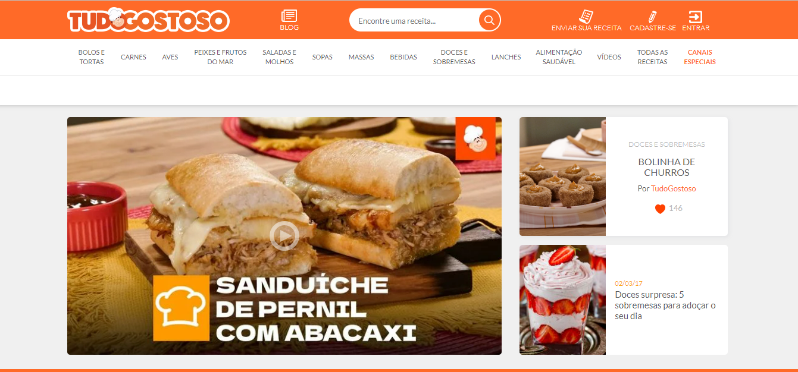

# Recriação da página inicial do site de receitas tudogostoso.com.br

<h2>Correções futuras:</h2>
1- Tornar responsivo  
2- Acrescentar mais receitas na página inicial  
3- Tornar os 2 menus fixos para que mesmo rolando a página para baixo eles continuem aparecendo  
4- Acrescentar lupa no campo de busca "Encontre sua receita..."
 
Minha criação:  

  
Site original:
